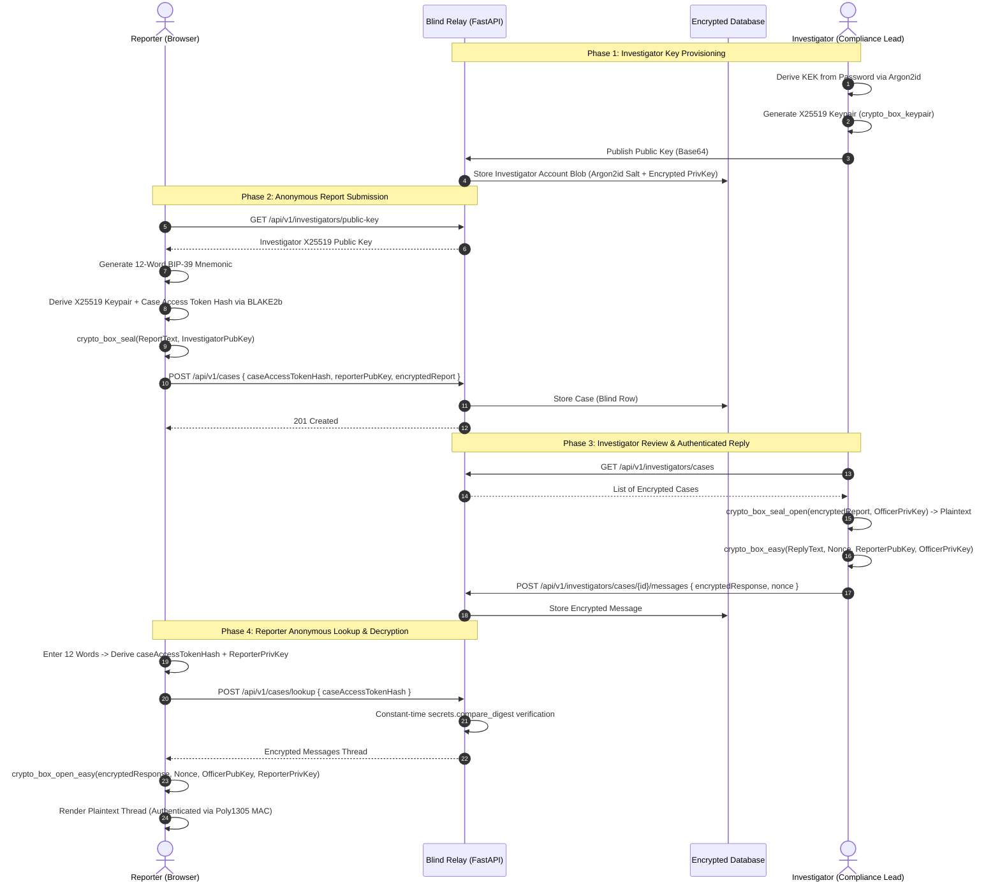

# SEALED — Zero-Knowledge E2EE Whistleblower Platform

> **A production-grade, cryptographically verifiable anonymous reporting system.**  
> Built with modern **Zero-Knowledge principles**, **Libsodium (WebAssembly)**, **BIP-39**, **FastAPI**, and **Next.js**.

---

## 1. Overview & Architecture

**SEALED** is an End-to-End Encrypted (E2EE) whistleblowing platform designed for corporate compliance, investigative journalism, and human rights advocacy. 

Unlike traditional "anonymous" dropboxes that rely on server-side promises, SEALED enforces anonymity through **mathematical and cryptographic guarantees**:
- The server acts as an **untrusted, blind storage relay**.
- Plaintext reports and private keys **never touch the network or database**.
- Reporters do not register accounts or handle technical UUIDs. A **12-word BIP-39 mnemonic phrase** is their sole cryptographic credential to access correspondence.

### Cryptographic Workflow Diagram



---

## 2. Threat Model & Security Guarantees

### What the System Guarantees

| Security Property | Mechanism & Guarantee |
| :--- | :--- |
| **Zero-Knowledge Relay** | The backend server and database administrator possess **zero knowledge** of report contents. All encryptions (`crypto_box_seal` and `crypto_box_easy`) execute entirely in browser memory prior to transit. |
| **Full Database Leak Resilience** | If the production database is compromised or publicly dumped, the attacker obtains only X25519 public keys, BLAKE2b token hashes, and authenticated ciphertexts. No plaintext reports, replies, or private keys can be recovered. |
| **No User Identification** | Reporters submit no emails, usernames, or phone numbers. No cookies or server sessions track identity. Technical case UUIDs are decoupled from reporter lookup. |
| **Timing-Attack Resistance** | Token hash comparisons on the server utilize constant-time `secrets.compare_digest` to prevent byte-by-byte timing side-channel leakage. |
| **Forward Integrity & Authenticity** | Replies from the compliance officer use `crypto_box_easy` (XSalsa20-Poly1305), guaranteeing both message privacy and tamper-proof sender authenticity via a 16-byte Poly1305 MAC. |

### Honest Architectural Limitations

In accordance with rigorous cryptographic engineering, SEALED explicitly highlights real-world threat boundaries:

1. **Web-E2EE Trust-On-First-Use (TOFU):**  
   Like all browser-based cryptography, the security of client-side execution assumes the integrity of the served JavaScript bundle. If the hosting infrastructure or CDN is malicious, it could serve modified JavaScript to exfiltrate keys.  
   *Mitigation:* Subresource Integrity (SRI) hashes, strict Content Security Policy (CSP), or packaging client code as a signed browser extension / desktop binary.
2. **Network Metadata & IP Privacy:**  
   Cryptographic encryption protects payload data, but HTTP headers and network packets inherently disclose the reporter’s IP address to network operators, VPNs, and server hosting providers.  
   *Mitigation:* Reporters requiring high-grade operational security (OpSec) must access SEALED through **Tor Browser** or an Onion Service (`.onion`).
3. **Endpoint Vulnerability:**  
   If the reporter's workstation is compromised with active spyware, screen grabbers, or hardware keyloggers, plaintext can be intercepted before encryption or when the 12-word mnemonic is shown.

---

## 3. Cryptographic Primitives

All cryptographic primitives are implemented using **Libsodium** (`libsodium-wrappers-sumo` compiled to WebAssembly with high-entropy CSPRNG):

| Primitive | Standard / Algorithm | Parameters / Size | Purpose in SEALED |
| :--- | :--- | :--- | :--- |
| **Mnemonic** | BIP-39 | 128-bit entropy (12 words) | User-friendly, seed derivation for reporter credentials. |
| **KDF & Domain Tags** | BLAKE2b (`crypto_generichash`) | 32-byte key/output, domain-separated | Deterministic derivation of Master Seed, Keypair Seed, and Access Token Hash. |
| **Anonymous Encryption** | ECIES Sealed Box (`crypto_box_seal`) | X25519 + XSalsa20 + Poly1305 (48-byte overhead) | One-way encryption of reports without disclosing the reporter's public key. |
| **Authenticated Chat** | `crypto_box_easy` | X25519 ECDH + XSalsa20 stream cipher + 24-byte nonce | Bidirectional, authenticated encryption for investigator replies. |
| **Message Integrity** | Poly1305 MAC | 16-byte authentication tag | Detects any ciphertext tampering or replay attempt. |
| **Key Derivation (KDF)** | Argon2id (`crypto_pwhash`) | Memory-hard, configurable ops/mem limits | Derives Key Encryption Key (KEK) from investigator password to unlock private key. |

---

## 4. Quickstart Guide

### Option A: Launch in 60 Seconds with Docker Compose

Ensure Docker and Docker Compose are installed, then run:

```bash
docker compose up --build
```

- **Frontend Application:** [http://localhost:3000](http://localhost:3000)
- **Backend REST API:** [http://localhost:8000](http://localhost:8000)
- **Interactive Swagger Docs:** [http://localhost:8000/docs](http://localhost:8000/docs)

*Note: The backend container automatically runs `seed.py` on startup, provisioning a test investigator.*

---

### Option B: Local Development (Without Docker)

#### 1. Backend Setup (FastAPI + Python 3.10+)

```bash
# In the repository root
python -m venv venv
source venv/bin/activate       # On Windows: venv\Scripts\activate

# Install dependencies
pip install -r requirements.txt

# Seed the database with the test investigator
python seed.py

# Run backend API server
uvicorn main:app --host 127.0.0.1 --port 8000 --reload
```

#### 2. Frontend Setup (Next.js 16 + TypeScript)

```bash
cd frontend

# Install Node dependencies
npm install

# Start Next.js development server
npm run dev
```

Visit [http://localhost:3000](http://localhost:3000).

---

## 5. Verification & Test Walkthrough

### Default Test Credentials (Pre-seeded)
- **Investigator Username:** `compliance.lead@integrity-trust.corp`
- **Investigator Password:** `Correct-Horse-Battery-Staple-2026!#`

### End-to-End Walkthrough:
1. **Submit Report (`/`):**  
   Enter your report text and click **«Запечатать и отправить»**.  
   Save your generated **12-word mnemonic phrase**.
2. **Access Investigator Portal (`/investigator`):**  
   Log in with the pre-filled credentials.  
   Click the incoming report, observe the client-side **Sealed Box decryption**, write an official reply, and send it.
3. **Track & Decrypt as Reporter (`/track`):**  
   Enter your **12 words** (automatically pre-filled from session or pasted manually) and click **«Проверить статус»**.  
   The client derives your private key, requests your thread, and decrypts the investigator's reply with verified Poly1305 MAC.

### Running Automated Test Suites:
```bash
# Python backend integration test suite
python test_api.py

# Autonomous cryptographic lifecycle PoC (pure TypeScript)
npx tsx poc.ts
```

---

## 6. License & Portfolio

Designed and engineered with precision by **Madi Alenov**.  
Open-source under the [MIT License](LICENSE).
